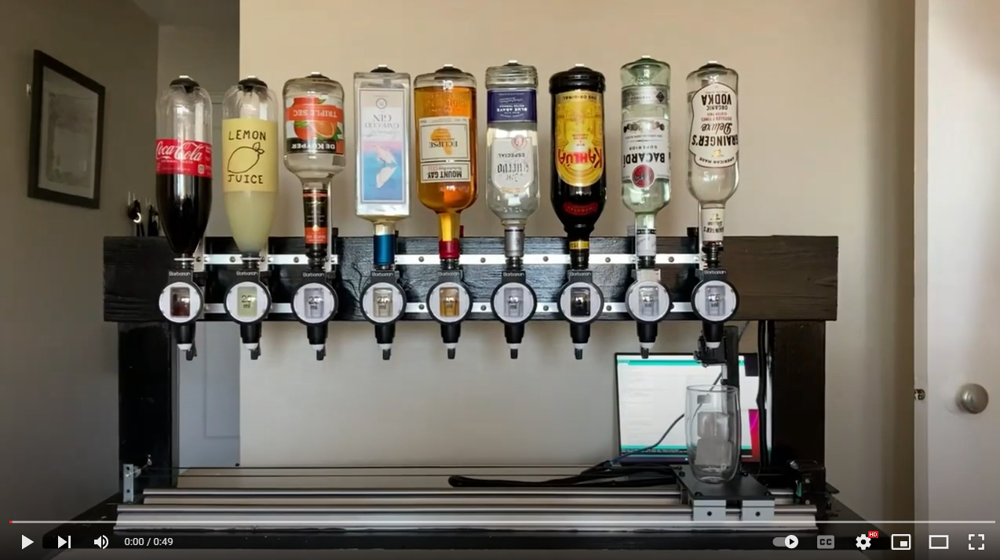
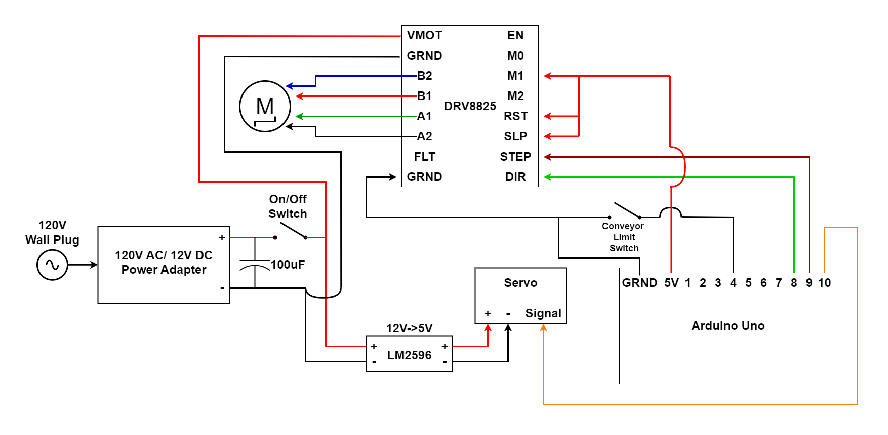

# Bartender Robot
Bartender Robot was created using an Arduino Uno, and will use any recipe programmed to create a drink of your choosing

## Table of Contents
- [Background](#background)
- [How It Works](#how-it-works)
- [Video](#video)
- [Circuit Schematic](#circuit-schematic)
- [Materials](#materials)
- [Sources](#sources)

## Background
This project was initially started while I was still an undergraduate. I wanted to apply what I had learned at university and further expand my knowledge through a project. I learned a lot through building the Bartender Robot, and found it a very rewarding experience to put what I had learned into a project.

## How it Works

- The Bartender Robot uses a platform attached to 2 linear rails to move the glass around. The platform is mounted on a total of 4 blocks that hold bearings to allow smooth operation along the rail.
- The platform is driven by a stepper motor. The stepper motor's shaft has a pulley attached, where a belt loops around and then at the opposite end, the belt loops around another pulley. Either end of this belt are then directly attached to the platform, causing it to move when the stepper motor spins.
- When the platform is positioned under a bottle, a servo motor that is attached to the platform pushes upwards onto a bar optic to dispense liquid. This is repeated as many times as required for the recipe chosen. 
- Once the recipe is completed, the platform returns back to it's starting position.
- The drink to be made is chosen from Arduino's Terminal with the Arduino attached to a computer. The recipe chosen will only be executed if the liquids in the recipe are among the current selection of liquids attached. The arraignment or selection of available liquids can be modified by selecting the appropriate options in the terminal. Once updated, selecting the recipe you'd like to make will now work.
- The Stepper Motor is driven by a Polulu DRV8825 motor driver, which is provided with 12V source and draws approximately 2 amps per phase
- The Servo Motor is provided with a 5V source and draws approximately 2.5 A
- The voltage requirements for each piece of equipment are supplied initally from a 120V->12V AC/DC Adapter that can be plugged directly into a wall outlet. This is then toggled by an on/off switch on the back of the bottle mounting bar.

## Video
Click on the below image to view a video on YouTube of the Bartender Robot

## Circuit Schematic

## Materials

Stepper Motor
- NEMA 17 Bipolar Stepper Motor
- Step Angle: 1.8deg
- Current: 2.0 Amps per phase
- Voltage: 12-24V
- Housing Screws: 4-M3
- Coils: 2 Phases, Red/Blue and Black/Green

Servo Motor
- MG996R Metal Gear Servo
- Stall Torque: 9.4 kg-cm @ 4.8V , 11 kg-cm @ 6V
- Operating Voltage: 4.8V – 7.2V
- Current: 3A draw @ 6V

Rails
- Orange A SCB16-1000mm Rail
- SBR1UU Bearing Block
- Carbon Steel Rails coated w/ a chrome plating
- Bearing Blocks are aluminum alloy housing with steel bearings

Motor Driver
- Pololu DRV8825
- Voltage: 8.2V – 45V
- Max current per phase: 2.2 A

Optics
- Barbarian 6 Rack Dispenser w/ 6 25mL Optics
- Barbarian 3 Rack Dispenser w/ 3 25mL Optics

LM2596 Buck Converter, 12V -> 5V for Servo
- Input Voltage: 3-40V
- Output Voltage: 1.5V – 35V
- Max current: 3A output, under 2.5A recommended

Belt
- GT2 Timing belt, 6mm width

Bearing
- 20 Tooth 5mm bore Timing Belt Pulley GT2

## Sources
